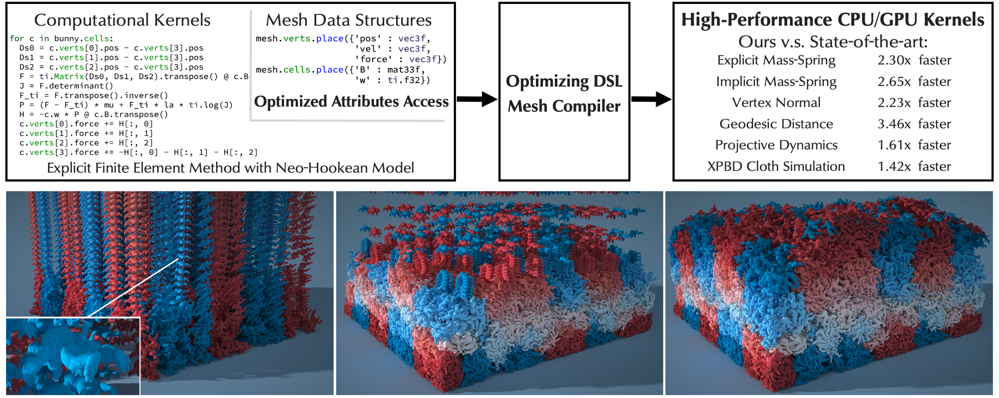
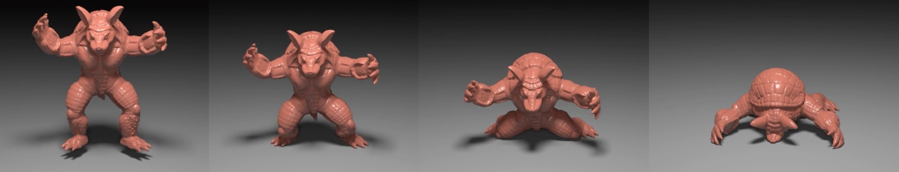
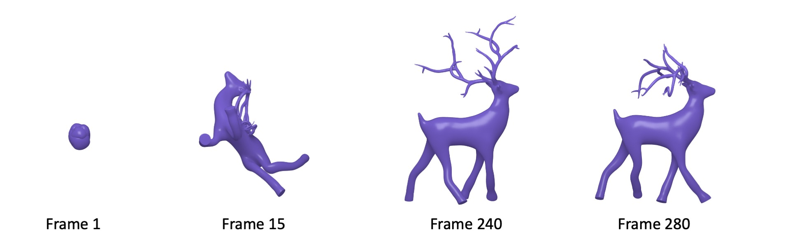
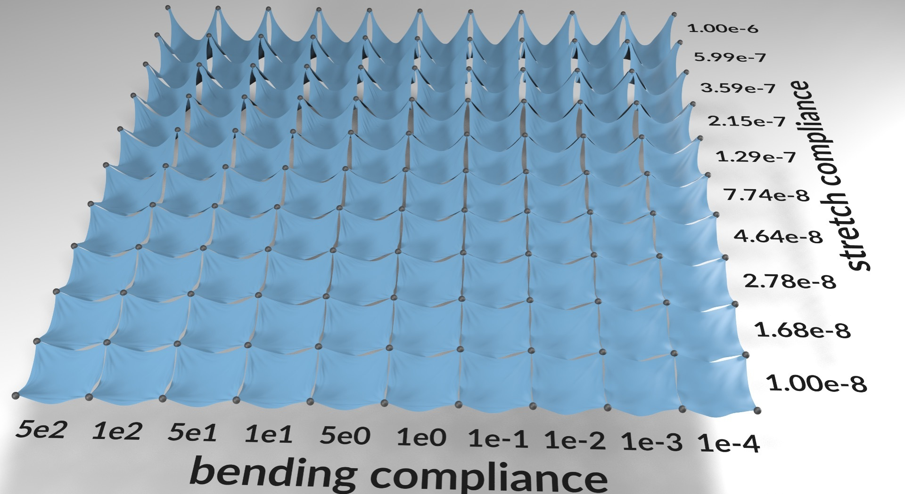
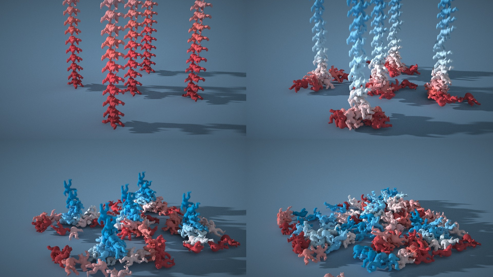

# MeshTaichi: A Compiler for Efficient Mesh-based Operations (SIGGRAPH Asia 2022)

*Chang Yu\*, Yi Xu\*, Ye Kuang, Yuanming Hu, Tiantian Liu (\* indicates equal contribution)*



[[Paper]](https://changyu.io/papers/yu2022meshtaichi.pdf) [[Video]](https://www.youtube.com/watch?v=vjBrk7k8SPE)

The MeshTaichi framework is now officially part of [Taichi](https://github.com/taichi-dev/taichi). This repo only contains examples.

### **A mesh compiler that provides an intuitive programming model for efficient mesh-based operations**
Meshes are an indispensable representation in many graphics applications because they provide conformal spatial discretizations. However, mesh-based operations are often slow due to unstructured memory access patterns. We propose MeshTaichi, a novel mesh compiler that provides an intuitive programming model for efficient mesh-based operations. Our programming model hides the complex indexing system from users and allows users to write mesh-based operations using reference-style neighborhood queries. Our compiler achieves its high performance by exploiting data locality. We partition input meshes and prepare the wanted relations by inspecting users’ code during compile time. During run time, we further utilize on-chip memory (shared memory on GPU and L1 cache on CPU) to access the wanted attributes of mesh elements efficiently. Our compiler decouples low-level optimization options with computations, so that users can explore different localized data attributes and different memory orderings without changing their computation code. As a result, users can write concise code using our programming model to generate efficient mesh-based computations on both CPU and GPU backends. 

#### **Usage**

We demonstrate the usage of MeshTaichi using an explicit finite element method example with the Neo-Hookean model following the course note [[Sifakis and Barbic 2012]](http://viterbi-web.usc.edu/~jbarbic/femdefo/). The First Piola-Kirchhoff stress tensor is given as:


=\\mu\\left(F-F^{-T}\\right)+\\lambda\\log(J)F^{-T}) (Eq.1)

where 𝐹 describes the deformation gradient, 𝐽 is the determinant of
𝐹 , and 𝜇 and 𝜆 are the Lamé coefficients.

#### **Describing the Mesh Data**

We need to define mesh data structures before applying them to computations. We provide the following APIs to create our new mesh data types:

```python
mesh = ti.TetMesh() # new tetrahedron mesh data type 
# mesh = ti.TriMesh() # new triangle mesh data type
```

Note that `mesh` is a mesh data type instead of a mesh instance. A `mesh` can be instantiated by multiple models.

The next step is to define the attributes for each mesh element. The type of a mesh attribute can be a scalar, a vector, a matrix, or their corresponding quantized versions. In this FEM example, each vertex has three attributes: the position `pos`, the velocity `vel` and the force applied to it `force`. All three attributes are floating-point type three-dimensional vectors based on the Taichi type system. Each (tetrahedral-)cell in the mesh has two attributes: the rest-pose volume `w` which is a floating-point scalar, and the inverted rest-pose shape matrix `B` which is a 3 × 3 matrix. The code snippet defining the mesh elements is listed below.

```python
 mesh.verts.place({'pos' : ti.math.vec3,
                   'vel' : ti.math.vec3,
                   'force' : ti.math.vec3})
 mesh.cells.place({'B' : ti.math.mat3,
                   'w' : ti.f32})
```

Once the data types are all defined, users can instantiate a modelwith an external file:

``` python
bunny = mesh.build('./bunny.mesh')
```

Our compiler can instantiate triangle meshes using surface repre- sentation formats like “.obj” and “.ply” files, or volumetric representation formats like “.mesh” file.

#### **Computing on a Mesh**

The mesh computations are declared within a `mesh-for` of a kernel, which can be as simple as shown below.

``` python
# parallel loop over all mesh cells
for c in bunny.cells:
  ...
# parallel loop over all mesh vertices
for v in bunny.verts:
  ...
```

A `mesh-for` has very similar syntax as a `range-for` which loops over the indices in an interval. It is specified with a mesh object’s element type (e.g., cells or vertices). Each element inside a mesh is queried with an index-free reference style. The elements’ indices and their corresponding memory addresses are hidden from the users. Our compiler parallelizes the outermost `mesh-for` loops with high-performance kernels, so that the looped mesh elements are efficiently computed in parallel.

Most mesh-based operations involve not only the attributes of an element, but the attributes of the neighboring elements as well. Our compiler allows users to access neighbor attributes either with reference-based queries using another nested sequential `mesh-for` loop or with index-based queries using a `range-for` loop as shown below.

``` python
for c in bunny.cells:
  total_force = c.verts[0].force
  # reference-based access
  for v in c.verts:
    total_force += v.force
```

``` python
for c in bunny.cells:
  total_force = c.verts[0].force
  # index-based access
  for i in range(c.verts.size):
    total_force += c.verts[i].force
```

Now we have the way to access the neighbors. Let us wrap everything up and write a `substep()` function to calculate the force (according to Eq. 1) and perform explicit time integration in a finite element simulation:

``` python
@ti.kernel
def substep():
  for c in bunny.cells:
    Ds0 = c.verts[0].pos - c.verts[3].pos
    Ds1 = c.verts[1].pos - c.verts[3].pos
    Ds2 = c.verts[2].pos - c.verts[3].pos
    F = ti.Matrix(Ds0, Ds1, Ds2).transpose() @ c.B
    J = F.determinant()
    F_ti = F.transpose().inverse()
    P = (F - F_ti) * mu + F_ti * la * ti.log(J)
    H = -c.w * P @ c.B.transpose()
    c.verts[0].force += H[:, 0]
    c.verts[1].force += H[:, 1]
    c.verts[2].force += H[:, 2]
    c.verts[3].force += -H[:, 0] - H[:, 1] - H[:, 2]
  
  for v in bunny.verts:
    # assuming unit mass for simplicity
    v.vel += dt * v.force 
    v.pos += dt * v.vel
```

#### **Interacting with Non-mesh Data**

Recall that we visit all elements in a `mesh-for` using their references, users do not need to bookkeep their corresponding indices. However, there are cases where the indices of elements are wanted. In these cases, we refer users to visit the `id` attribute of an element. We demonstrate an example to export the positions of vertices to an external multi-dimensional array as follows:

``` python
# An 1D array of len(bunny.verts) 3D f32 vectors
pos_ex = ti.Vector.field(3, ti.f32, shape=len(bunny.verts))

@ti.kernel
def export():
  for v in bunny.verts:
    pos_ex[v.id] = v.pos
```

For more details of the usage of our programming language, please refer to our paper or see the examples in this repo.

We test MeshTaichi on a variety of physically-based simulation and geometry processing applications with both triangle and tetrahedron meshes. MeshTaichi achieves a consistent speedup ranging from 1.4× to 6×, compared to state-of-the-art mesh data structures and compilers.

## How to run

### Install the latest Taichi first.
Install the latest Taichi by:
```
python3 -m pip install —U taichi
```

### Mass Spring



To reproduce the mass-spring system:
``` bash
cd mass_spring && python3 ms.py --model models/armadillo0.1.node [--cpu]
```

For more details, please refer to this [documentation](mass_spring/README.md).

### Projective Dynamics



To reproduce the projective dynamics:
``` bash
cd projective_dynamics && python3 pd.py --model models/deer.1.node [--cpu]
```

For more details, please refer to this [documentation](projective_dynamics/README.md).

### XPBD Cloth Simulation



To reproduce the XPBD cloth simulation:
``` bash
cd xpbd_cloth && python3 models/gen_cloth.py && mkdir results && python3 run_multiple.py --output ./results
```

For more details, please refer to this [documentation](xpbd_cloth/README.md).

### Mesh-Grid Hybrid Simulation



To reproduce the mesh-grid hybrid simulation:
``` bash
cd lag_mpm && mkdir results && python3 run.py --output ./results && python3 render_particles.py
```

For more details, please refer to this [documentation](lag_mpm/README.md).

---

### Bibtex
```
@article{yu2022meshtaichi,
  title={MeshTaichi: A Compiler for Efficient Mesh-based Operations},
  author={Yu, Chang and Xu, Yi and Kuang, Ye and Hu, Yuanming and Liu, Tiantian},
  journal={ACM Transactions on Graphics (TOG)},
  volume={41},
  number={6},
  year={2022},
  publisher={ACM}
}
```
