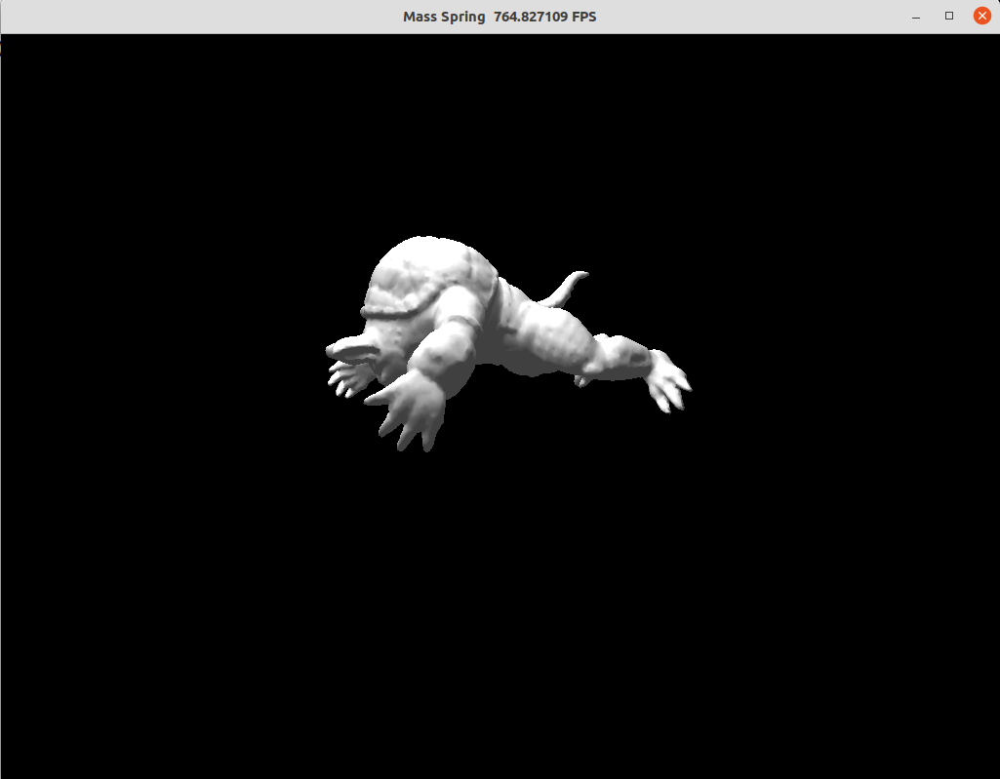

# Mass-Spring System

An explicit mass-spring system (A larger version is in our video).


## How to run:

CUDA:

```
python3 ms.py --model models/armadillo0.1.node --arch cuda
```

CPU:

```
python3 ms.py --model models/armadillo0.1.node --arch cpu
```

## Results



