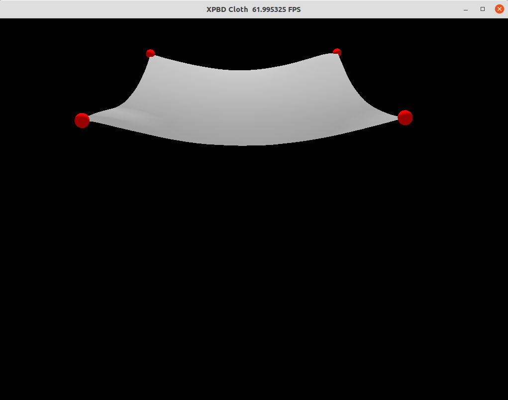

# XPBD Cloth Simulation

An eXtended Position-Based Dynamics simulation of a piece of cloth. We implemented both stretch and bending constraints to better simulate a real cloth.

## How to run:

A toy-case demo is provided for showing simulation in real-time:

CUDA:

```
python3 run_demo.py --arch cuda
```

CPU:

```
python3 run_demo.py --arch cpu
```

To reproduce the high-resolution 10x10 cloth simulation in our video. You could run the following commands to generate cloth first and then begin simulation. We suggest you run the script using CUDA:

```
python3 models/gen_cloth.py
mkdir results
python3 run_multiple.py --output ./results --arch cuda
```

## Results (demo case)



